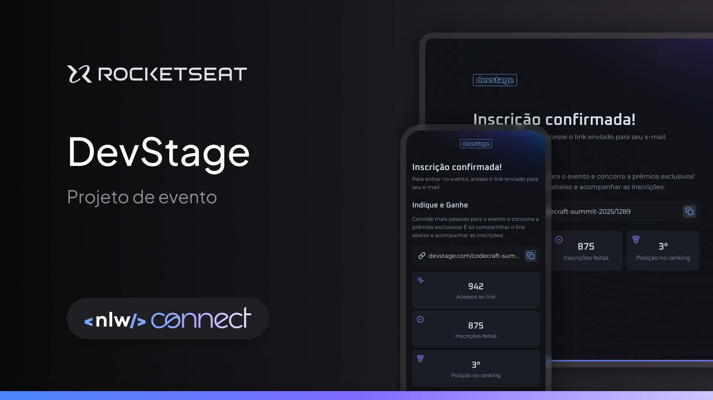

<h1 align="center">
  
</h1>



## Projeto 💻

O projeto é um site responsivo de inscrição e indicação para eventos.

## Tecnologias

Esse projeto foi desenvolvido com as seguintes tecnologias:

- [React](https://react.dev/)
- [Next.js](https://nextjs.org/)
- [TailwindCSS](https://tailwindcss.com/)
- [TypeScript](https://www.typescriptlang.org/)

---

## Acessar o Projeto

Para acessar o projeto, primeiro, clonar o repositório, baixando o arquivo .zip apenas clicando neste link -> [Baixar arquivo zip](https://github.com/pduartesilva2005/nlw-connect-react/archive/refs/heads/main.zip) ou executando esse seguinte comando:

```
# https
git clone https://github.com/pduartesilva2005/nlw-connect-react

# ssh
git clone git@github.com:pduartesilva2005/nlw-connect-react.git

# github cli
gh repo clone pduartesilva2005/nlw-connect-react
```

Depois de ter clonado o repositório, necessita instalar as dependências do projeto, executando os seguintes comandos:

```
npm i #or npm install
# or
yarn add .
# or
pnpm install
```

Feito isso, execute o projeto, com esse comando a seguir:

```
npm run dev
# or
yarn dev
# or
pnpm dev
```

Em seguida, você pode abrir com [http://localhost:3000](http://localhost:3000) com seu navegador para ver o resultado

Obs: precisa baixar o repositório back-end do projeto através neste [link](https://github.com/rocketseat-education/nlw-connect-node)

Criado por Pedro Duarte